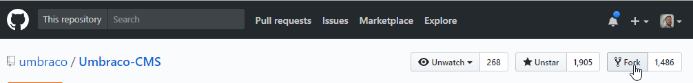
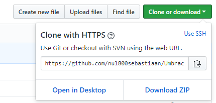
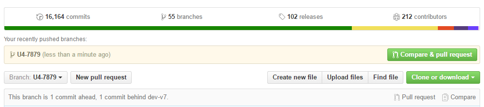

# Contributing to Umbraco CMS

👍🎉 First off, thanks for taking the time to contribute! 🎉👍

These contribution guidelines are mostly just that - guidelines, not rules. This is what we've found to work best over the years, but if you choose to ignore them, we still love you! 💖 Use your best judgement, and feel free to propose changes to this document in a pull request.

## Coding not your thing? Or want more ways to contribute?

This document covers contributing to the codebase of the CMS but [the community site has plenty of inspiration for other ways to get involved.][get involved]

If you don't feel you'd like to make code changes here, you can visit our [documentation repository][docs repo] and use your experience to contribute to making the docs we have, even better.

We also encourage community members to feel free to comment on others' pull requests and issues - the expertise we have is not limited to the Core Collaborators and HQ. So, if you see something on the issue tracker or pull requests you feel you can add to, please don't be shy.

## Table of contents

- [Before you start](#before-you-start)
  * [Code of Conduct](#code-of-conduct)
  * [What can I contribute?](#what-can-i-contribute)
    + [Making larger changes](#making-larger-changes)
    + [Pull request or package?](#pull-request-or-package)
    + [Ownership and copyright](#ownership-and-copyright)
- [Finding your first issue: Up for grabs](#finding-your-first-issue-up-for-grabs)
- [Making your changes](#making-your-changes)
    + [Keeping your Umbraco fork in sync with the main repository](#keeping-your-umbraco-fork-in-sync-with-the-main-repository)
    + [Style guide](#style-guide)
    + [Questions?](#questions)
- [Creating a pull request](#creating-a-pull-request)
- [The review process](#the-review-process)
  * [Dealing with requested changes](#dealing-with-requested-changes)
    + [No longer available?](#no-longer-available)
  * [The Core Collaborators team](#the-core-collaborators-team)

## Before you start


### Code of Conduct

This project and everyone participating in it, is governed by the [our Code of Conduct][code of conduct].

### What can I contribute?

We categorise pull requests (PRs) into two categories:

| PR type   | Definition                                                   |
| --------- | ------------------------------------------------------------ |
| Small PRs | Bug fixes and small improvements - can be recognized by seeing a small number of changes and possibly a small number of new files. |
| Large PRs | New features and large refactorings - can be recognized by seeing a large number of changes, plenty of new files, updates to package manager files (NuGet’s packages.config, NPM’s packages.json, etc.). |

We’re usually able to handle small PRs pretty quickly. A community volunteer will do the initial review and flag it for Umbraco HQ as “community tested”. If everything looks good, it will be merged pretty quickly [as per the described process][review process].

We would love to follow the same process for larger PRs but this is not always possible due to time limitations and priorities that need to be aligned. We don’t want to put up any barriers, but this document should set the correct expectations. 

Not all changes are wanted, so on occasion we might close a PR without merging it but if we do, we will give you feedback why we can't accept your changes. **So make sure to [talk to us before making large changes][making larger changes]**, so we can ensure that you don't put all your hard work into something we would not be able to merge.

#### Making larger changes

[making larger changes]: #making-larger-changes

Please make sure to describe your larger ideas in an [issue (bugs)][issues] or [discussion (new features)][discussions], it helps to put in mock up screenshots or videos. If the change makes sense for HQ to include in Umbraco CMS we will leave you some feedback on how we’d like to see it being implemented. 

If a larger pull request is encouraged by Umbraco HQ, the process will be similar to what is described in the small PRs process above, we strive to feedback within 14 days. Finalizing and merging the PR might take longer though as it will likely need to be picked up by the development team to make sure everything is in order. We’ll keep you posted on the progress.

#### Pull request or package?

[pr or package]: #pull-request-or-package

If you're unsure about whether your changes belong in the core Umbraco CMS or if you should turn your idea into a package instead, make sure to [talk to us][making larger changes].

If it doesn’t fit in CMS right now, we will likely encourage you to make it into a package instead. A package is a great way to check out popularity of a feature, learn how people use it, validate good usability and fix bugs. Eventually, a package could "graduate" to be included in the CMS.

#### Ownership and copyright

It is your responsibility to make sure that you're allowed to share the code you're providing us. For example, you should have permission from your employer or customer to share code.

Similarly, if your contribution is copied or adapted from somewhere else, make sure that the license allows you to reuse that for a contribution to Umbraco-CMS.

If you're not sure, leave a note on your contribution and we will be happy to guide you.

When your contribution has been accepted, it will be [MIT licensed][MIT license] from that time onwards.

## Finding your first issue: Up for grabs

Umbraco HQ will regularly mark newly created issues on the issue tracker with [the `community/up-for-grabs` tag][up for grabs issues]. This means that the proposed changes are wanted in Umbraco but the HQ does not have the time to make them at this time. We encourage anyone to pick them up and help out.

If you do start working on something, make sure to leave a small comment on the issue saying something like: "I'm working on this". That way other people stumbling upon the issue know they don't need to pick it up, someone already has.

## Making your changes

Great question! The short version goes like this:

1. **Fork**

    Create a fork of [`Umbraco-CMS` on GitHub][Umbraco CMS repo]
    
    
    
1. **Clone**

    When GitHub has created your fork, you can clone it in your favorite Git tool
    
     
    
1. **Switch to the correct branch**

    Switch to the `v10/contrib` branch

1. **Build**

    Build your fork of Umbraco locally as described in the build documentation: you can [debug with Visual Studio Code][build - debugging with code] or [with Visual Studio][build - debugging with vs].

1. **Branch**

    Create a new branch now and name it after the issue you're fixing, we usually follow the format: `temp-12345`. This means it's a temporary branch for the particular issue you're working on, in this case issue number `12345`.  Don't commit to `v10/contrib`, create a new branch first.

1. **Change**

    Make your changes, experiment, have fun, explore and learn, and don't be afraid. We welcome all contributions and will [happily give feedback][questions].

1. **Commit and push**

    Done? Yay! 🎉

    Remember to commit to your new `temp` branch, and don't commit to `v10/contrib`. Then you can push the changes up to your fork on GitHub.

#### Keeping your Umbraco fork in sync with the main repository
[sync fork]: #keeping-your-umbraco-fork-in-sync-with-the-main-repository

Once you've already got a fork and cloned your fork locally, you can skip steps 1 and 2 going forward. Just remember to keep your fork up to date before making further changes.

To sync your fork with this original one, you'll have to add the upstream url. You only have to do this once:

```
git remote add upstream https://github.com/umbraco/Umbraco-CMS.git
```

Then when you want to get the changes from the main repository:

```
git fetch upstream
git rebase upstream/v10/contrib
```

In this command we're syncing with the `v10/contrib` branch, but you can of course choose another one if needed.

[More information on how this works can be found on the thoughtbot blog.][sync fork ext]

#### Style guide

To be honest, we don't like rules very much. We trust you have the best of intentions and we encourage you to create working code. If it doesn't look perfect then we'll happily help clean it up.

That said, the Umbraco development team likes to follow the hints that ReSharper gives us (no problem if you don't have this installed) and we've added a `.editorconfig` file so that Visual Studio knows what to do with whitespace, line endings, etc.

#### Questions?
[questions]: #questions

You can get in touch with [the core contributors team][core collabs] in multiple ways; we love open conversations and we are a friendly bunch. No question you have is stupid. Any question you have usually helps out multiple people with the same question. Ask away:

- If there's an existing issue on the issue tracker then that's a good place to leave questions and discuss how to start or move forward.
- If you want to ask questions on some code you've already written you can create a draft pull request, [detailed in a GitHub blog post][draft prs].
- Unsure where to start? Did something not work as expected? Try leaving a note in the ["Contributing to Umbraco"][contrib forum] forum. The team monitors that one closely, so one of us will be on hand and ready to point you in the right direction.

## Creating a pull request

Exciting! You're ready to show us your changes.

We recommend you to [sync with our repository][sync fork] before you submit your pull request. That way, you can fix any potential merge conflicts and make our lives a little bit easier.

GitHub will have picked up on the new branch you've pushed and will offer to create a Pull Request. Click that green button and away you go.


We like to use [git flow][git flow] as much as possible, but don't worry if you are not familiar with it. The most important thing you need to know is that when you fork the Umbraco repository, the default branch is set to something, usually `v10/contrib`. If you are working on v9, this is the branch you should be targeting.

Please note: we are no longer accepting features for v8 and below but will continue to merge security fixes as and when they arise.

## The review process
[review process]: #the-review-process

You've sent us your first contribution - congratulations! Now what?

The [Core Collaborators team][Core collabs] can now start reviewing your proposed changes and give you feedback on them. If it's not perfect, we'll either fix up what we need or we can request that you make some additional changes.

You will get an initial automated reply from our [Friendly Umbraco Robot, Umbrabot][Umbrabot], to acknowledge that we’ve seen your PR and we’ll pick it up as soon as we can. You can take this opportunity to double check everything is in order based off the handy checklist Umbrabot provides.

You will get feedback as soon as the [Core Collaborators team][Core collabs] can after opening the PR. You’ll most likely get feedback within a couple of weeks. Then there are a few possible outcomes:

- Your proposed change is awesome! We merge it in and it will be included in the next minor release of Umbraco
- If the change is a high priority bug fix, we will cherry-pick it into the next patch release as well so that we can release it as soon as possible
- Your proposed change is awesome but needs a bit more work, we’ll give you feedback on the changes we’d like to see
- Your proposed change is awesome but... not something we’re looking to include at this point. We’ll close your PR and the related issue (we’ll be nice about it!). See [making larger changes][making larger changes] and [pull request or package?][pr or package]

### Dealing with requested changes

If you make the corrections we ask for in the same branch and push them to your fork again, the pull request automatically updates with the additional commit(s) so we can review it again. If all is well, we'll merge the code and your commits are forever part of Umbraco!

#### No longer available?

We understand you have other things to do and can't just drop everything to help us out.

So if we’re asking for your help to improve the PR we’ll wait for two weeks to give you a fair chance to make changes. We’ll ask for an update if we don’t hear back from you after that time.  

If we don’t hear back from you for 4 weeks, we’ll close the PR so that it doesn’t just hang around forever. You’re very welcome to re-open it once you have some more time to spend on it.  

There will be times that we really like your proposed changes and we’ll finish the final improvements we’d like to see ourselves. You still get the credits and your commits will live on in the git repository.

### The Core Collaborators team
[Core collabs]: #the-core-collaborators-team

The Core Contributors team consists of one member of Umbraco HQ, [Sebastiaan][Sebastiaan], who gets assistance from the following community members who have committed to volunteering their free time:

- [Nathan Woulfe][Nathan Woulfe]
- [Joe Glombek][Joe Glombek]
- [Laura Weatherhead][Laura Weatherhead]
- [Michael Latouche][Michael Latouche]
- [Owain Williams][Owain Williams]


These wonderful people aim to provide you with a reply to your PR, review and test out your changes and on occasions, they might ask more questions. If they are happy with your work, they'll let Umbraco HQ know by approving the PR. HQ will have final sign-off and will check the work again before it is merged.

<!-- Reference links for easy updating -->

<!-- Local -->

[MIT license]: ../LICENSE.md	"Umbraco's license declaration"
[build - debugging with vs]: BUILD.md#debugging-with-visual-studio	"Details on building and debugging Umbraco with Visual Studio"
[build - debugging with code]: BUILD.md#debugging-with-vs-code	"Details on building and debugging Umbraco with Visual Studio Code"

<!-- External -->

[Nathan Woulfe]: https://github.com/nathanwoulfe	"Nathan's GitHub profile"
[Joe Glombek]: https://github.com/glombek	"Joe's GitHub profile"
[Laura Weatherhead]: https://github.com/lssweatherhead	"Laura's GitHub profile"
[Michael Latouche]: https://github.com/mikecp	"Michael's GitHub profile"
[Owain Williams]: https://github.com/OwainWilliams	"Owain's GitHub profile"
[Sebastiaan]: https://github.com/nul800sebastiaan	"Senastiaan's GitHub profile"
[ Umbrabot ]: https://github.com/umbrabot
[git flow]: https://jeffkreeftmeijer.com/git-flow/	"An explanation of git flow"
[sync fork ext]: http://robots.thoughtbot.com/post/5133345960/keeping-a-git-fork-updated	"Details on keeping a git fork updated"
[draft prs]: https://github.blog/2019-02-14-introducing-draft-pull-requests/	"Github's blog post providing details on draft pull requests"
[contrib forum]: https://our.umbraco.com/forum/contributing-to-umbraco-cms/
[get involved]: https://community.umbraco.com/get-involved/
[docs repo]: https://github.com/umbraco/UmbracoDocs
[code of conduct]: https://github.com/umbraco/.github/blob/main/.github/CODE_OF_CONDUCT.md
[up for grabs issues]: https://github.com/umbraco/Umbraco-CMS/issues?q=is%3Aissue+is%3Aopen+label%3Acommunity%2Fup-for-grabs
[Umbraco CMS repo]: https://github.com/umbraco/Umbraco-CMS
[issues]: https://github.com/umbraco/Umbraco-CMS/issues
[discussions]: https://github.com/umbraco/Umbraco-CMS/discussions
