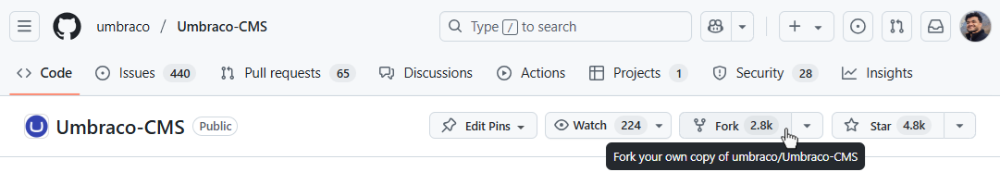
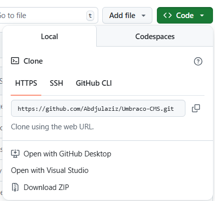

# Contributing to Umbraco CMS

👍🎉 First of all, thanks for taking the time to contribute! 🎉👍

These contribution guidelines are mostly just that - guidelines, not rules. This is what we've found to work best over the years, but if you choose to ignore them, we still love you! 💖 Use your best judgment, and feel free to propose changes to this document in a pull request.

We have a guide on [what to consider before you start](contributing-before-you-start.md) and more detailed guides at the end of this article.

## Contribution guide

This guide describes each step to make your first contribution:

1. **Fork**

   Create a fork of [`Umbraco-CMS` on GitHub](https://github.com/umbraco/Umbraco-CMS)

   

2. **Clone**

   When GitHub has created your fork, you can clone it in your favorite Git tool or on the command line with `git clone https://github.com/[YourUsername]/Umbraco-CMS`.

   

3. **Switch to the correct branch**

   Switch to the `main` branch

4. **Branch out**

   Create a new branch based on `main` and name it after the issue you're fixing. For example: `v15/bugfix/18132-rte-tinymce-onchange-value-check`.

   Please follow this format for branches: `v{major}/{feature|bugfix|task}/{issue}-{description}`.

   This is a development branch for the particular issue you're working on, in this case, a bug-fix for issue number `18132` that affects Umbraco v.15.

   Don't commit to `main`, create a new branch first.

5. **Build or run a Development Server**

   You can build or run a Development Server with any IDE that supports .NET or the command line.

   Read [Build or run a Development Server](BUILD.md) for the right approach to your needs.

6. **Change**

   Make your changes, experiment, have fun, explore and learn, and don't be afraid. We welcome all contributions and will [happily give feedback](contributing-first-issue.md#questions).

7. **Commit and push**

   Done? Yay! 🎉

   Remember to commit to your branch. When it's ready, push the changes to your fork on GitHub.

8. **Create pull request**

   On GitHub, in your forked repository (`https://github.com/[YourUsername]/Umbraco-CMS`), you will see a banner saying that you pushed a new branch and a button to make a pull request. Tap the button and follow the instructions.

   Would you like to read further? [Creating a pull request and what happens next](contributing-creating-a-pr.md).

## Further contribution guides

- [Before you start](contributing-before-you-start.md)
- [Finding your first issue](contributing-first-issue.md)
- [Contributing to the new backoffice](https://docs.umbraco.com/umbraco-backoffice/)
- [Unwanted changes](contributing-unwanted-changes.md)
- [Other ways to contribute](contributing-other-ways-to-contribute.md)

