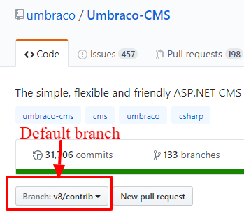

# Contributing to Umbraco CMS

👍🎉 First off, thanks for taking the time to contribute! 🎉👍

The following is a set of guidelines for contributing to Umbraco CMS.

These are mostly guidelines, not rules. Use your best judgment, and feel free to propose changes to this document in a pull request.

Remember, we're a friendly bunch and are happy with whatever contribution you might provide. Below are guidelines for success that we've gathered over the years. If you choose to ignore them then we still love you 💖.

**Code of conduct**

This project and everyone participating in it is governed by the [our Code of Conduct](CODE_OF_CONDUCT.md). By participating, you are expected to uphold this code. Please report unacceptable behavior to [Sebastiaan Janssen - sj@umbraco.dk](mailto:sj@umbraco.dk).

**Table of contents**

[Contributing code changes](#contributing-code-changes)
  * [Guidelines for contributions we welcome](#guidelines-for-contributions-we-welcome)
  * [What can I start with?](#what-can-i-start-with)
  * [How do I begin?](#how-do-i-begin)
  * [Pull requests](#pull-requests)

[Reviews](#reviews)
  * [Styleguides](#styleguides)
  * [The PR team](#the-pr-team)
  * [Questions?](#questions)

[Working with the code](#working-with-the-code)
  * [Building Umbraco from source code](#building-umbraco-from-source-code)
  * [Working with the source code](#working-with-the-source-code)
  * [Making changes after the PR was opened](#making-changes-after-the-pr-was-opened)
  * [Which branch should I target for my contributions?](#which-branch-should-i-target-for-my-contributions)
  * [Keeping your Umbraco fork in sync with the main repository](#keeping-your-umbraco-fork-in-sync-with-the-main-repository)

## Contributing code changes

This document gives you a quick overview on how to get started.

### Guidelines for contributions we welcome

Not all changes are wanted, so on occassion we might close a PR without merging it. We will give you feedback why we can't accept your changes and we'll be nice about it, thanking you for spending your valuable time.

We have [documented what we consider small and large changes](CONTRIBUTION_GUIDELINES.md). Make sure to talk to us before making large changes.

Remember, if an issue is in the `Up for grabs` list or you've asked for some feedback before you sent us a PR, your PR will not be closed as unwanted.

### What can I start with?

Unsure where to begin contributing to Umbraco? You can start by looking through [these `Up for grabs` issues](https://github.com/umbraco/Umbraco-CMS/issues?utf8=%E2%9C%93&q=is%3Aissue+is%3Aopen+label%3Acommunity%2Fup-for-grabs+)

### How do I begin?

Great question! The short version goes like this:

  * **Fork** - create a fork of [`Umbraco-CMS` on GitHub](https://github.com/umbraco/Umbraco-CMS)

  

  * **Clone** - when GitHub has created your fork, you can clone it in your favorite Git tool

  

  * **Build** - build your fork of Umbraco locally as described in [building Umbraco from source code](BUILD.md)
  * **Change** - make your changes, experiment, have fun, explore and learn, and don't be afraid. We welcome all contributions and will [happily give feedback](#questions)
  * **Commit** - done? Yay! 🎉 **Important:** create a new branch now and name it after the issue you're fixing, we usually follow the format: `temp-12345`. This means it's a temporary branch for the particular issue you're working on, in this case `12345`. When you have a branch, commit your changes. Don't commit to `dev-v8`, create a new branch first.
  * **Push** - great, now you can push the changes up to your fork on GitHub
  * **Create pull request** - exciting! You're ready to show us your changes (or not quite ready, you just need some feedback to progress). GitHub has picked up on the new branch you've pushed and will offer to create a Pull Request. Click that green button and away you go.

  

### Pull requests
The most successful pull requests usually look a like this:

  * Fill in the required template
  * Include screenshots and animated GIFs in your pull request whenever possible.
  * Unit tests, while optional are awesome, thank you!
  * New code is commented with documentation from which [the reference documentation](https://our.umbraco.com/documentation/Reference/) is generated

Again, these are guidelines, not strict requirements.

## Reviews

You've sent us your first contribution, congratulations! Now what?

The [pull request team](#the-pr-team) can now start reviewing your proposed changes and give you feedback on them. If it's not perfect, we'll either fix up what we need or we can request you to make some additional changes.

We have [a process in place which you can read all about](REVIEW_PROCESS.md). The very abbreviated version is:

- Your PR will get a reply within 48 hours
- An in-depth reply will be added within at most 2 weeks
- The PR will be either merged or rejected within at most 4 weeks
- Sometimes it is difficult to meet these timelines and we'll talk to you

### Styleguides

To be honest, we don't like rules very much. We trust you have the best of intentions and we encourage you to create working code. If it doesn't look perfect then we'll happily help clean it up.

That said, the Umbraco development team likes to follow the hints that ReSharper gives us (no problem if you don't have this installed) and we've added a `.editorconfig` file so that Visual Studio knows what to do with whitespace, line endings, etc.

### The PR team

The pull request team consists of a member of Umbraco HQ, [Sebastiaan](https://github.com/nul800sebastiaan), who gets assistance from the following community members

- [Anders Bjerner](https://github.com/abjerner)
- [Dave Woestenborghs](https://github.com/dawoe)
- [Emma Burstow](https://github.com/emmaburstow)
- [Poornima Nayar](https://github.com/poornimanayar)

These wonderful volunteers will provide you with a first reply to your PR, review and test out your changes and might ask more questions. After that they'll let Umbraco HQ know if everything seems okay.

### Questions?

You can get in touch with [the PR team](#the-pr-team) in multiple ways, we love open conversations and we are a friendly bunch. No question you have is stupid. Any questions you have usually helps out multiple people with the same question. Ask away:

- If there's an existing issue on the issue tracker then that's a good place to leave questions and discuss how to start or move forward
- Unsure where to start? Did something not work as expected? Try leaving a note in the ["Contributing to Umbraco"](https://our.umbraco.com/forum/contributing-to-umbraco-cms/) forum, the team monitors that one closely

## Working with the code

### Building Umbraco from source code

In order to build the Umbraco source code locally, first make sure you have the following installed.

  * Visual Studio 2017 v15.9.7+
  * Node v10+
  * npm v6.4.1+

The easiest way to get started is to run `build.ps1` which will build both the backoffice (also known as "Belle") and the Umbraco core. You can then easily start debugging from Visual Studio, or if you need to debug Belle you can run `gulp dev` in `src\Umbraco.Web.UI.Client`. See [this page](BUILD.md) for more details.

Alternatively, you can open `src\umbraco.sln` in Visual Studio 2017 (version 15.9.7 or higher, [the community edition is free](https://www.visualstudio.com/thank-you-downloading-visual-studio/?sku=Community&rel=15) for you to use to contribute to Open Source projects). In Visual Studio, find the Task Runner Explorer (in the View menu under Other Windows) and run the build task under the gulpfile.


After this build completes, you should be able to hit `F5` in Visual Studio to build and run the project. A IISExpress webserver will start and the Umbraco installer will pop up in your browser, follow the directions there to get a working Umbraco install up and running.

### Working with the source code

Some parts of our source code are over 10 years old now. And when we say "old", we mean "mature" of course!

There's two big areas that you should know about:

  1. The Umbraco backoffice is a extensible AngularJS app and requires you to run a `gulp dev` command while you're working with it, so changes are copied over to the appropriate directories and you can refresh your browser to view the results of your changes.
  You may need to run the following commands to set up gulp properly:
  ```
  npm cache clean --force
  npm install
  npm run build
  ```
  2. "The rest" is a C# based codebase, which is mostly ASP.NET MVC based. You can make changes, build them in Visual Studio, and hit `F5` to see the result.

To find the general areas of something you're looking to fix or improve, have a look at the following two parts of the API documentation.

  * [The AngularJS based backoffice files](https://our.umbraco.com/apidocs/ui/#/api) (to be found  in `src\Umbraco.Web.UI.Client\src`)
  * [The C# application](https://our.umbraco.com/apidocs/csharp/)

### Which branch should I target for my contributions?

We like to use [Gitflow as much as possible](https://jeffkreeftmeijer.com/git-flow/), don't worry if you are not familiar with it. The most important thing you need to know is that when you fork the Umbraco repository, the default branch is set to something, usually `dev-v8`. Whatever the default is, that's where we'd like you to target your contributions.



### Making changes after the PR was opened

If you make the corrections we ask for in the same branch and push them to your fork again, the pull request automatically updates with the additional commit(s) so we can review it again. If all is well, we'll merge the code and your commits are forever part of Umbraco!

### Keeping your Umbraco fork in sync with the main repository

We recommend you sync with our repository before you submit your pull request. That way, you can fix any potential merge conflicts and make our lives a little bit easier.

Also, if you've submitted a pull request three weeks ago and want to work on something new, you'll want to get the latest code to build against of course.

To sync your fork with this original one, you'll have to add the upstream url, you only have to do this once:

```
git remote add upstream https://github.com/umbraco/Umbraco-CMS.git
```

Then when you want to get the changes from the main repository:

```
git fetch upstream
git rebase upstream/v8/dev
```

In this command we're syncing with the `v8/dev` branch, but you can of course choose another one if needed.

(More info on how this works: [http://robots.thoughtbot.com/post/5133345960/keeping-a-git-fork-updated](http://robots.thoughtbot.com/post/5133345960/keeping-a-git-fork-updated))
