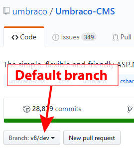
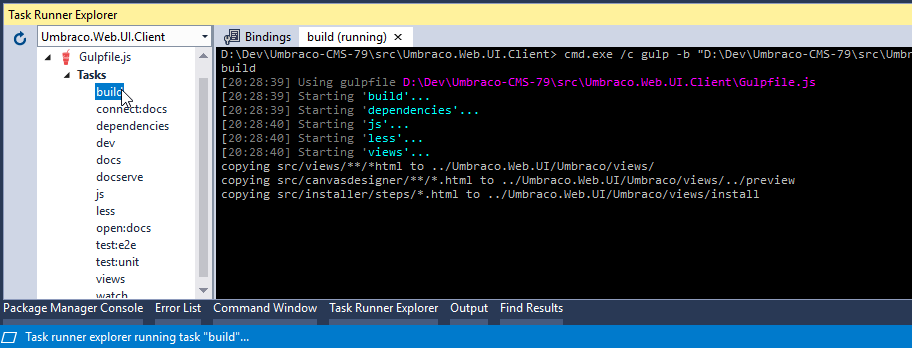

# Contributing in detail

There's more than one way to contribute to Umbraco, there's some more suggestions below.

When contributing code to Umbraco there's plenty of things you'll want to know, skip down to [What should I know before I get started](#what-should-i-know-before-i-get-started) for the answers to your burning questions.

#### Table Of Contents

[How Can I Contribute?](#how-can-i-contribute)
  * [Reporting Bugs](#reporting-bugs)
  * [Suggesting Enhancements](#suggesting-enhancements)
  * [Your First Code Contribution](#your-first-code-contribution)
  * [Pull Requests](#pull-requests)

[Styleguides](#styleguides)

[What should I know before I get started?](#what-should-i-know-before-i-get-started)
  * [Working with the source code](#working-with-the-source-code)
  * [What branch should I target for my contributions?](#what-branch-should-i-target-for-my-contributions)
  * [Building Umbraco from source code](#building-umbraco-from-source-code)
  * [Keeping your Umbraco fork in sync with the main repository](#keeping-your-umbraco-fork-in-sync-with-the-main-repository)

## How Can I Contribute?

### Reporting Bugs
This section guides you through submitting a bug report for Umbraco CMS. Following these guidelines helps maintainers and the community understand your report 📝, reproduce the behavior 💻 💻, and find related reports 🔎.

Before creating bug reports, please check [this list](#before-submitting-a-bug-report) as you might find out that you don't need to create one. When you are creating a bug report, please [include as many details as possible](#how-do-i-submit-a-good-bug-report). Fill out [the required template](https://github.com/umbraco/Umbraco-CMS/issues/new/choose), the information it asks for helps us resolve issues faster.

> **Note:** If you find a **Closed** issue that seems like it is the same thing that you're experiencing, open a new issue and include a link to the original issue in the body of your new one.

##### Before Submitting A Bug Report

  * Most importantly, check **if you can reproduce the problem** in the [latest version of Umbraco](https://our.umbraco.com/download/). We might have already fixed your particular problem.
  * It also helps tremendously to check if the issue you're experiencing is present in **a clean install** of the Umbraco version you're currently using. Custom code can have side-effects that don't occur in a clean install.
  * **Use the Google**. Whatever you're experiencing, Google it plus "Umbraco" - usually you can get some pretty good hints from the search results, including open issues and further troubleshooting hints.
  * If you do find and existing issue has **and the issue is still open**, add a comment to the existing issue if you have additional information. If you have the same problem and no new info to add, just "star" the issue.

Explain the problem and include additional details to help maintainers reproduce the problem. The following is a long description which we've boiled down into a few very simple questions in the issue tracker when you create a new issue. We're listing the following hints to indicate that the most successful reports usually have a lot of this ground covered:

  * **Use a clear and descriptive title** for the issue to identify the problem.
  * **Describe the exact steps which reproduce the problem** in as many details as possible. For example, start by explaining which steps you took in the backoffice to get to a certain undesireable result, e.g. you created a document type, inherting 3 levels deep, added a certain datatype, tried to save it and you got an error.
  * **Provide specific examples to demonstrate the steps**. If you wrote some code, try to provide a code sample as specific as possible to be able to reproduce the behavior.
  * **Describe the behavior you observed after following the steps** and point out what exactly is the problem with that behavior.
  * **Explain which behavior you expected to see instead and why.**

Provide more context by answering these questions:

  * **Can you reproduce the problem** when `debug="false"` in your `web.config` file?
  * **Did the problem start happening recently** (e.g. after updating to a new version of Umbraco) or was this always a problem?
  * **Can you reliably reproduce the issue?** If not, provide details about how often the problem happens and under which conditions it normally happens.

Include details about your configuration and environment:

  * **Which version of Umbraco are you using?**
  * **What is the environment you're using Umbraco in?** Is this a problem on your local machine or on a server. Tell us about your configuration: Windows version, IIS/IISExpress, database type, etc.
  * **Which packages do you have installed?**

### Suggesting Enhancements

This section guides you through submitting an enhancement suggestion for Umbraco, including completely new features and minor improvements to existing functionality. Following these guidelines helps maintainers and the community understand your suggestion 📝 and find related suggestions 🔎.

Most of the suggestions in the [reporting bugs](#reporting-bugs) section also count for suggesting enhancements.

Some additional hints that may be helpful:

  * **Include screenshots and animated GIFs** which help you demonstrate the steps or point out the part of Umbraco which the suggestion is related to.
  * **Explain why this enhancement would be useful to most Umbraco users** and isn't something that can or should be implemented as a [community package](https://our.umbraco.com/projects/).

### Your First Code Contribution

Unsure where to begin contributing to Umbraco? You can start by looking through [these `Up for grabs` and issues](https://issues.umbraco.org/issues?q=&project=U4&tagValue=upforgrabs&release=&issueType=&search=search) or on the [new issue tracker](https://github.com/umbraco/Umbraco-CMS/issues?q=is%3Aopen+is%3Aissue+label%3Acommunity%2Fup-for-grabs).

### Pull Requests

The most successful pull requests usually look a like this:

  * Fill in the required template
  * Include screenshots and animated GIFs in your pull request whenever possible.
  * Unit tests, while optional are awesome, thank you!
  * New code is commented with documentation from which [the reference documentation](https://our.umbraco.com/documentation/Reference/) is generated

Again, these are guidelines, not strict requirements.

## Making changes after the PR was opened

If you make the corrections we ask for in the same branch and push them to your fork again, the pull request automatically updates with the additional commit(s) so we can review it again. If all is well, we'll merge the code and your commits are forever part of Umbraco!

## Styleguides

To be honest, we don't like rules very much. We trust you have the best of intentions and we encourage you to create working code. If it doesn't look perfect then we'll happily help clean it up.

That said, the Umbraco development team likes to follow the hints that ReSharper gives us (no problem if you don't have this installed) and we've added a `.editorconfig` file so that Visual Studio knows what to do with whitespace, line endings, etc.

## What should I know before I get started?

### Working with the source code

Some parts of our source code is over 10 years old now. And when we say "old", we mean "mature" of course!

There's two big areas that you should know about:

  1. The Umbraco backoffice is a extensible AngularJS app and requires you to run a `gulp dev` command while you're working with it, so changes are copied over to the appropriate directories and you can refresh your browser to view the results of your changes.
  You may need to run the following commands to set up gulp properly:
  ```
  npm cache clean
  npm install -g gulp
  npm install -g gulp-cli
  npm install
  gulp build
  ```
  2. "The rest" is a C# based codebase, with some traces of our WebForms past but mostly ASP.NET MVC based these days. You can make changes, build them in Visual Studio, and hit `F5` to see the result.

To find the general areas of something you're looking to fix or improve, have a look at the following two parts of the API documentation.

  * [The AngularJS based backoffice files](https://our.umbraco.com/apidocs/ui/#/api) (to be found  in `src\Umbraco.Web.UI.Client\src`)
  * [The rest](https://our.umbraco.com/apidocs/csharp/)

### What branch should I target for my contributions?

We like to use [Gitflow as much as possible](https://jeffkreeftmeijer.com/git-flow/), don't worry if you are not familiar with it. The most important thing you need to know is that when you fork the Umbraco repository, the default branch is set to something, usually `dev-v8`. Whatever the default is, that's where we'd like you to target your contributions.



### Building Umbraco from source code

In order to build the Umbraco source code locally, first make sure you have the following installed.

  * Visual Studio 2017 v15.3+
  * Node v10+ (Installed via `build.bat` script. If you already have it installed, make sure you're running at least v10)
  * npm v6.4.1+ (Installed via `build.bat` script. If you already have it installed, make sure you're running at least v6.4.1)

The easiest way to get started is to run `build.bat` which will build both the backoffice (also known as "Belle") and the Umbraco core. You can then easily start debugging from Visual Studio, or if you need to debug Belle you can run `gulp dev` in `src\Umbraco.Web.UI.Client`. See [this page](BUILD.md) for more details.

Alternatively, you can open `src\umbraco.sln` in Visual Studio 2017 (version 15.3 or higher, [the community edition is free](https://www.visualstudio.com/thank-you-downloading-visual-studio/?sku=Community&rel=15) for you to use to contribute to Open Source projects). In Visual Studio, find the Task Runner Explorer (in the View menu under Other Windows) and run the build task under the gulpfile.



After this build completes, you should be able to hit `F5` in Visual Studio to build and run the project. A IISExpress webserver will start and the Umbraco installer will pop up in your browser, follow the directions there to get a working Umbraco install up and running.

### Keeping your Umbraco fork in sync with the main repository

We recommend you sync with our repository before you submit your pull request. That way, you can fix any potential merge conflicts and make our lives a little bit easier.

Also, if you've submitted a pull request three weeks ago and want to work on something new, you'll want to get the latest code to build against of course.

To sync your fork with this original one, you'll have to add the upstream url, you only have to do this once:

```
git remote add upstream https://github.com/umbraco/Umbraco-CMS.git
```

Then when you want to get the changes from the main repository:

```
git fetch upstream
git rebase upstream/dev-v8
```

In this command we're syncing with the `dev-v8` branch, but you can of course choose another one if needed.

(More info on how this works: [http://robots.thoughtbot.com/post/5133345960/keeping-a-git-fork-updated](http://robots.thoughtbot.com/post/5133345960/keeping-a-git-fork-updated))
