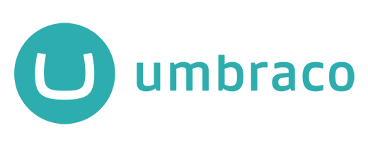

# [Umbraco CMS](https://umbraco.com)

 
 
 
 
 
 

Umbraco is the friendliest, most flexible and fastest growing ASP.NET CMS, and used by more than 500,000 websites worldwide. Our mission is to help you deliver delightful digital experiences by making Umbraco friendly, simpler and social.

Learn more at [umbraco.com](https://umbraco.com)

  

See the official [Umbraco website](https://umbraco.com) for an introduction, core mission and values of the product and team behind it.

- [Getting Started](#getting-started)
- [Documentation](#documentation)
- [Community](#join-the-umbraco-community)
- [Contributing](#contributing)

Please also see our [Code of Conduct](https://github.com/umbraco/.github/blob/main/.github/CODE_OF_CONDUCT.md).

## Getting Started

[Umbraco Cloud](https://umbraco.com/cloud) is the easiest and fastest way to use Umbraco yet, with full support for all your custom .NET code and integrations. You're up and running in less than a minute, and your life will be made easier with automated upgrades and a built-in deployment engine. We offer a free 14-day trial, no credit card needed.

If you want to DIY, then you can [download Umbraco]((https://our.umbraco.com/download)) either as a ZIP file or via NuGet. It's the same version of Umbraco CMS that powers Umbraco Cloud, but you'll need to find a place to host it yourself, and handling deployments and upgrades will be all up to you.

## Documentation

The documentation for Umbraco CMS can be found [on Our Umbraco](https://docs.umbraco.com/). The source for the Umbraco docs is [open source as well](https://github.com/umbraco/UmbracoDocs) and we're happy to look at your documentation contributions.

## Join the Umbraco community

Our friendly community is available 24/7 at the community hub, we call ["Our Umbraco"](https://our.umbraco.com/). Our Umbraco features forums for questions and answers, documentation, downloadable plugins for Umbraco, and a rich collection of community resources.

Besides "Our", we all support each other in our [Community Discord Server](https://discord.gg/umbraco) and on Twitter: [Umbraco HQ](https://twitter.com/umbraco), [Release Updates](https://twitter.com/umbracoproject), [#umbraco](https://twitter.com/hashtag/umbraco)

## Contributing

Umbraco is contribution-focused and community-driven. If you want to contribute back to the Umbraco source code, please check out our [guide to contributing](CONTRIBUTING.md).
