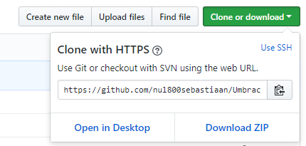

## Finding your first issue

Umbraco HQ will regularly mark newly created issues on the issue tracker with [the `community/up-for-grabs` tag][up for grabs issues]. This means that the proposed changes are wanted in Umbraco but the HQ does not have the time to make them at this time. In adding the label we will endeavour to provide some guidelines on how to go about the implementation, such that it aligns with the project. We encourage anyone to pick them up and help out.

You don't need to restrict yourselves to issues that are specifically marked as "up for grabs" though. If you are running into a bug you have reported or found on the [issue tracker][issue tracker], it's not necessary to wait for HQ response. Feel free to dive in and try to provide a fix, raising questions as you need if you have concerns about the modifications necessary to resolve the problem.

If you do start working on something, make sure to leave a small comment on the issue saying something like: "I'm working on this". That way other people stumbling upon the issue know they don't need to pick it up, someone already has.

## Making your changes

Great question! The short version goes like this:

1. **Fork**

    Create a fork of [`Umbraco-CMS` on GitHub][Umbraco CMS repo]

    

1. **Clone**

    When GitHub has created your fork, you can clone it in your favorite Git tool

    

1. **Switch to the correct branch**

    Switch to the `contrib` branch

1. **Build**

    Build your fork of Umbraco locally as described in the build documentation: you can [debug with Visual Studio Code][build - debugging with code] or [with Visual Studio][build - debugging with vs].

1. **Branch**

    Create a new branch now and name it after the issue you're fixing, we usually follow the format: `temp-12345`. This means it's a temporary branch for the particular issue you're working on, in this case issue number `12345`.  Don't commit to `contrib`, create a new branch first.

1. **Change**

    Make your changes, experiment, have fun, explore and learn, and don't be afraid. We welcome all contributions and will [happily give feedback][questions].

1. **Commit and push**

    Done? Yay! 🎉

    Remember to commit to your new `temp` branch, and don't commit to `contrib`. Then you can push the changes up to your fork on GitHub.

#### Keeping your Umbraco fork in sync with the main repository
[sync fork]: #keeping-your-umbraco-fork-in-sync-with-the-main-repository

Once you've already got a fork and cloned your fork locally, you can skip steps 1 and 2 going forward. Just remember to keep your fork up to date before making further changes.

To sync your fork with this original one, you'll have to add the upstream url. You only have to do this once:

```
git remote add upstream https://github.com/umbraco/Umbraco-CMS.git
```

Then when you want to get the changes from the main repository:

```
git fetch upstream
git rebase upstream/contrib
```

In this command we're syncing with the `contrib` branch, but you can of course choose another one if needed.

[More information on how this works can be found on the thoughtbot blog.][sync fork ext]

#### Style guide

To be honest, we don't like rules very much. We trust you have the best of intentions and we encourage you to create working code. If it doesn't look perfect then we'll happily help clean it up.

That said, the Umbraco development team likes to follow the hints that ReSharper gives us (no problem if you don't have this installed) and we've added a `.editorconfig` file so that Visual Studio knows what to do with whitespace, line endings, etc.

#### Questions?
[questions]: #questions

You can get in touch with [the core contributors team][core collabs] in multiple ways; we love open conversations and we are a friendly bunch. No question you have is stupid. Any question you have usually helps out multiple people with the same question. Ask away:

- If there's an existing issue on the issue tracker then that's a good place to leave questions and discuss how to start or move forward.
- If you want to ask questions on some code you've already written you can create a draft pull request, [detailed in a GitHub blog post][draft prs].
- Unsure where to start? Did something not work as expected? Try leaving a note in the ["Contributing to Umbraco"][contrib forum] forum. The team monitors that one closely, so one of us will be on hand and ready to point you in the right direction.


  <!-- Local -->

[build - debugging with vs]: BUILD.md#debugging-with-visual-studio	"Details on building and debugging Umbraco with Visual Studio"
[build - debugging with code]: BUILD.md#debugging-with-vs-code	"Details on building and debugging Umbraco with Visual Studio Code"


[sync fork ext]: http://robots.thoughtbot.com/post/5133345960/keeping-a-git-fork-updated	"Details on keeping a git fork updated"
[draft prs]: https://github.blog/2019-02-14-introducing-draft-pull-requests/	"Github's blog post providing details on draft pull requests"
[contrib forum]: https://our.umbraco.com/forum/contributing-to-umbraco-cms/
[Umbraco CMS repo]: https://github.com/umbraco/Umbraco-CMS
[up for grabs issues]: https://github.com/umbraco/Umbraco-CMS/issues?q=is%3Aissue+is%3Aopen+label%3Acommunity%2Fup-for-grabs
[issue tracker]: https://github.com/umbraco/Umbraco-CMS/issues